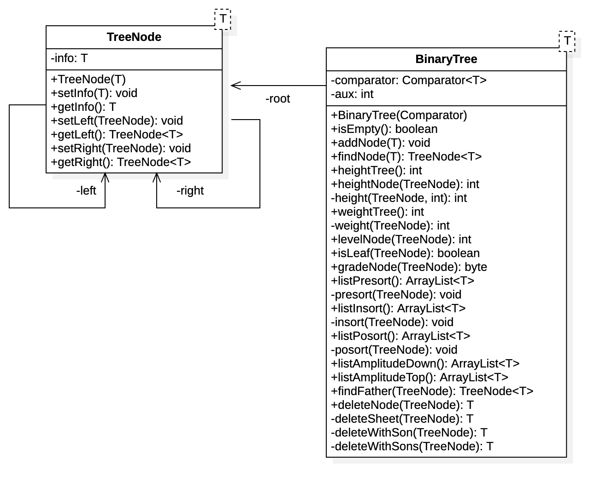

# Árboles Binarios de Búsqueda

Proyecto para la implementación de la lógica de un árbol binario de búsqueda en Java

## Herramientas

- Java 17
- Editor IntellijIdea

## Diagrama

## Clase TreeNode

Especifica el Nodo que contiene la información de los objetos que componen el árbol binario.

### Atributos

- ___info___ Atributo que contiene la información del nodo, se parametriza para poder hacer referencia a un objeto cualquiera
- ___left___ Referencia al hijo o subárbol por izquierda
- ___right___ Referencia al hijo o subárbol por derecha

### Métodos

- ___TreeNode___ Constructor de la clase, recibe la referencia de la info de nodo
- ___set & get___ Métodos de interfaz de la clase

## Clase BinaryTree

Contiene la lógica del árbol binario a través de cada uno de los métodos

### Atributos

- ___root___ Referencia a la raíz del árbol binario.
- ___comparator___ Atributo de la Interfaz `Comparator<T>` que permite especificar el campo del objeto parametrizado o clave  que se va a tener en cuenta para establecer la posición de cada nodo en el árbol.
- ___aux___ Variable auxiliar de tipo entero que se usa en varios de los métodos para ayudar en su funcionalidad

### Métodos

- ___BinaryTree___ Constructor de la clase, recibe el `Comparator<T>` como parámetro
- ___isEmpty___ Permite validar si el árbol se encuentra vacío (`root==null`), retorna falso o verdadero
- ___addNode___ Permite agregar un nuevo nodo al árbol, recibe como parámetro la info a partir de la cual se crea el nuevo nodo.
- ___listPresort___ Permite recorrer el árbol usando el método `preorden` se apoya en un método privado recursivo `presort()`. Retorna un `ArrayList<T>` con los objetos del árbol respectivos conforme al orden de recorrido
- ___presort___ Método privado recursivo que realiza las llamadas recursivas para recorrer el árbol en `preorden` 
- ___listInsort___ Permite recorrer el árbol usando el método `inorden` se apoya en un método privado recursivo `insort()`. Retorna un `ArrayList<T>` con los objetos del árbol respectivos conforme al orden de recorrido
- ___insort___ Método privado recursivo que realiza las llamadas recursivas para recorrer el árbol en `inorden` 
- ___listPosort___ Permite recorrer el árbol usando el método `posorden` se apoya en un método privado recursivo `posort()`. Retorna un `ArrayList<T>` con los objetos del árbol respectivos conforme al orden de recorrido
- ___posort___ Método privado recursivo que realiza las llamadas recursivas para recorrer el árbol en `posorden`

